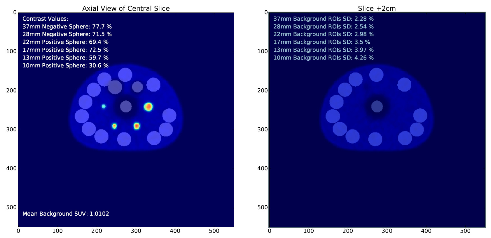

# NEMA_IQ_Tester
Provides Automated Measurement of 4:1 &amp; 8:1 Contrast-to-background Ratio NEMA IQ Phantom Preparations

Check Readme.pdf for instructions on use

Applies NEMA NU-2 Measurement Metholology to standard 6-sphere image quality phantom. Requires phantom has
been prepared according to standard contrast-to-background ratios of 4:1 or 8:1. Will yield contrast measurements
as percentage out of 100% for each fo the small positive contrast spheres and the two large negative
contrast spheres. Outputs PDF report named for date of acquisition and scanner.
A CSV is also saved which allows direct access measurement values. Bundled Win32 EXE file (no python pre-requisites)
is too large for github (140 MB), but contact if interested.
-Price

